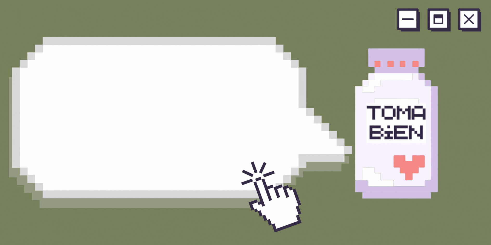
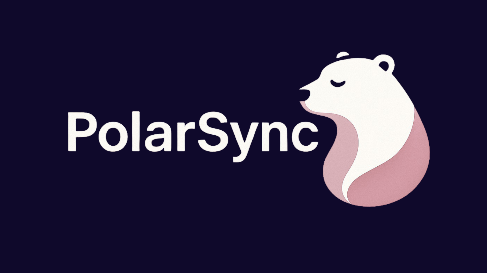

## Hi there, I'm Aylen 👋

  
## 🚀 Check out my newest project!

  

  

 

## 🙋🏻‍♀️ About me:

* Mobile Developer.
* Technical degree on mobile applications development. UNLaM (Argentina)
* Creating apps since 2019.
* Currently learning Swift and SwiftUI.

 

### 🔨 Currently developing:

* [BookTracker](https://github.com/ailenaguino/BookTracker)
* [PolarSync](https://github.com/MeyrForge/PolarSync)
* [Bag of Holding | DM's Vault](https://github.com/MeyrForge/BagOfHolding-DMsVault)

 

### 🛡️ MeyrForge projects (my startup!):

* [TomaBien](https://github.com/MeyrForge/TomaBien)  A medication tracker 💊⌚

* [PolarSync](https://github.com/MeyrForge/PolarSync)  Track. Comprehend. Progress. 📊🫂

* [Bag of Holding | DM's Vault](https://github.com/MeyrForge/BagOfHolding-DMsVault) Cause even the DM needs an inventory! 📜🐉

 

### 👨🏻‍🎓 Projects I made or participated in at university:

* [NurAlignMobile](https://github.com/ailenaguino/NurAlignMobile) : Final degree project. Daily tracker for bipolar people.
* [Infonete](https://github.com/ailenaguino/InfoneteRecargado) : Mid degree project. Consortium ADM using C# and Javascript.
* [Cat-Facts](https://github.com/ailenaguino/CatFactsAndroid) : Early degree project. Random facts about cats using Kotlin.

 

## ⚙️ GitHub Stats

